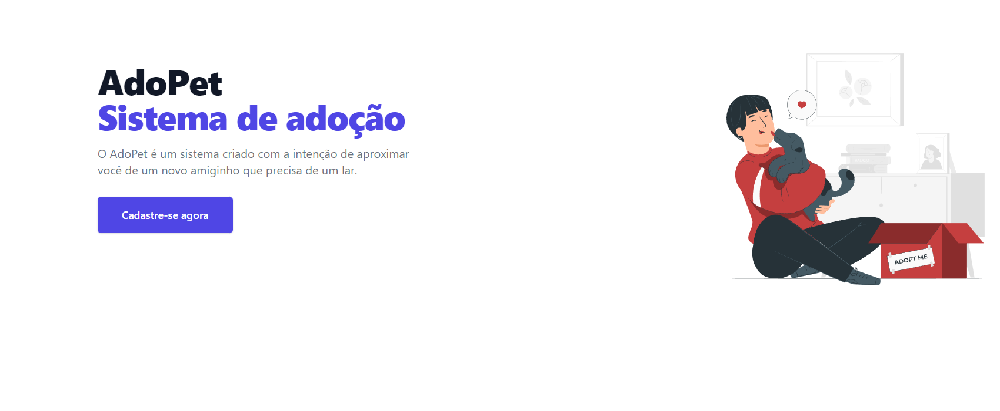

<p align="center"><a href="https://laravel.com" target="_blank"></a></p>

## Sobre o projeto

AdoPet é um sistema que tem como funcionalidade principal te aproximar de um animalzinho que precisa de um lar. Para fazer isso é bem simples, basta se cadastrar no site e você tera acesso aos animais disponiveis para adoção.


## Tecnologias utilizadas

Nesse projeto foi utilizado as seguintes tecnologias:

* laravel
* tailwind
* MySql
* git


## Recursos do Laravel Utilizados

Nesse projeto os seguintes recursos foram utilizados:
* Autenticação
* Migrations
* Seeders
* Factory
* validations
* PHP Unit (Testes)

## Como rodar o projeto

Para rodar o projeto é bem simples, basta clonar o projeto e rodar os comandos:

**crie o arquivo .env**
```
cp .env.example .env
```
Apos isso configure o seu .env com as informações do seu banco.

**rode o composer e gere a key com o artisan**
```
composer update
php artisan key:generate
```

**Rode o npm**
```
npm install
```
**inicie o server e o vite** 
```
npm run dev
php artisan serve
```
**Provavelmente você vera a tela inicial do sistema**




